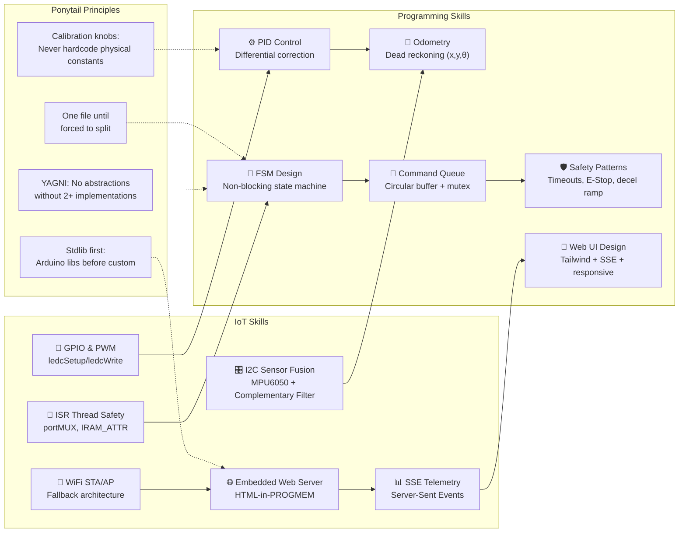
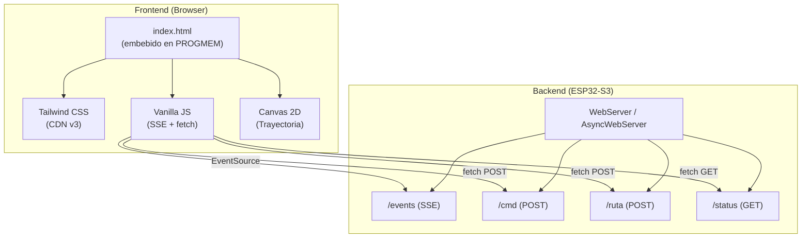

# 🔬 Análisis Completo del Proyecto VeranoInve — Carro Robot Autónomo

> [!NOTE]
> Análisis exhaustivo usando el **Principio de No-Contradicción** para identificar y resolver conflictos entre las múltiples fuentes de código, configuración y documentación del proyecto.

---

## 1. Diagrama de Ensamble del Circuito — ESP32-S3-DevKitC-1


### Pin Mapping Definitivo (Fuente de Verdad: `hal_pins.cpp`)

| Función | GPIO (ESP32-S3) | Notas |
|---------|-----------------|-------|
| **ENA** (PWM Motor Izq) | `GPIO 15` | LEDC Canal 0, 5kHz, 8-bit |
| **IN1** (Dir Motor Izq) | `GPIO 16` | HIGH/LOW = Adelante/Atrás |
| **IN2** (Dir Motor Izq) | `GPIO 17` | Complemento de IN1 |
| **ENB** (PWM Motor Der) | `GPIO 18` | LEDC Canal 1, 5kHz, 8-bit |
| **IN3** (Dir Motor Der) | `GPIO 8` | HIGH/LOW = Adelante/Atrás |
| **IN4** (Dir Motor Der) | `GPIO 9` | ✅ Reasignado de GPIO3 (strapping fix C-02) |
| **Encoder Izq** (D0) | `GPIO 4` | INPUT_PULLUP, ISR RISING |
| **Encoder Der** (D0) | `GPIO 5` | INPUT_PULLUP, ISR RISING |
| **SDA** (MPU6050) | `GPIO 6` | I2C Data, 400kHz |
| **SCL** (MPU6050) | `GPIO 7` | I2C Clock |
| **LED IDLE** (Verde) | `GPIO 38` | OUTPUT, 220Ω resistor |
| **LED MOVING** (Azul) | `GPIO 39` | OUTPUT, 220Ω resistor |
| **LED ERROR** (Rojo) | `GPIO 40` | OUTPUT, 220Ω resistor |
| **E-STOP** (Botón) | `GPIO 41` | INPUT_PULLDOWN, 10kΩ pull-down |

### Conexiones del Diagrama ASCII

```
                          ┌─────────────────┐
                          │  ESP32-S3-DevKit │
                          │                 │
        ┌─────────────────┤ GPIO15 (ENA) ───┤──→ L298N ENA (PWM)
        │  MPU6050        │ GPIO16 (IN1) ───┤──→ L298N IN1         ┌──────────┐
        │  ┌──────┐       │ GPIO17 (IN2) ───┤──→ L298N IN2    ┌──→│ Motor Izq│
        │  │ SDA ─┤───────┤ GPIO6           │                 │   └──────────┘
        │  │ SCL ─┤───────┤ GPIO7           │ L298N OUT1/OUT2─┘
        │  │ VCC ─┤───3V3─┤                 │
        │  │ GND ─┤───GND─┤ GPIO18 (ENB) ───┤──→ L298N ENB (PWM)
        │  └──────┘       │ GPIO8  (IN3) ───┤──→ L298N IN3         ┌──────────┐
        │                 │ GPIO9  (IN4) ───┤──→ L298N IN4    ┌──→│ Motor Der│
        │  Encoders       │                 │ L298N OUT3/OUT4─┘   └──────────┘
        │  ┌──────┐       │ GPIO4  (ENC_I)──┤ ← D0 Encoder Izq
        │  │ D0 ──┤───────┤ GPIO5  (ENC_D)──┤ ← D0 Encoder Der     ┌───────┐
        │  │ VCC ─┤───3V3─┤                 │                  12V──┤L298N  │
        │  │ GND ─┤───GND─┤ GPIO38 ─[220Ω]──┤──→ 🟢 LED IDLE       │  VMS  │
        │  └──────┘       │ GPIO39 ─[220Ω]──┤──→ 🔵 LED MOVING      │  GND──┤──GND
        │                 │ GPIO40 ─[220Ω]──┤──→ 🔴 LED ERROR       └───────┘
        │  E-STOP         │                 │
        │  ┌──────┐       │ GPIO41 ─[10kΩ]──┤──→ GND (pull-down)
        │  │ BTN ─┤───────┤       ─[3V3]────┤ (activo HIGH)
        │  └──────┘       │                 │
                          └─────────────────┘
```

---

## 2. Análisis de Contradicciones — Principio de No-Contradicción

> [!IMPORTANT]
> **Principio:** Una proposición y su negación no pueden ser ambas verdaderas al mismo tiempo y en el mismo sentido. Aplicado al código: dos fuentes no pueden definir valores diferentes para la misma constante/pin y ambos ser correctos.

### Tabla de Contradicciones Detectadas

| ID | Contradicción | Fuente A (dice X) | Fuente B (dice ¬X) | Gravedad | Resolución |
|----|--------------|-------------------|---------------------|----------|------------|
| **C-01** | **Pin mapping L298N** | Legacy code: `ENA=13, IN1=12, IN2=14, IN3=27, IN4=26, ENB=25` | Current `hal_pins.cpp`: `ENA=15, IN1=16, IN2=17, ENB=18, IN3=8, IN4=9` | 🔴 CRÍTICA | **hal_pins.cpp es correcto.** Los pines legacy son para ESP32 clásico (no existen GPIO27/26/25/14 disponibles en ESP32-S3) |
| **C-02** | **GPIO3 como IN4** | `hal_pins.cpp` usa GPIO3 para IN4 | `hardware_pinout_specs.md` lista GPIO3 como pin de strapping JTAG | ~~🟡 MEDIA~~ ✅ RESUELTO | **Corregido.** `PIN_IN4 = 9`. GPIO3 es JTAG source select; puede causar problemas al boot si hay señal residual. |
| **C-03** | **API de PWM** | Legacy: `ledcAttach(pin, freq, res)` (ESP32 Core v3.x) | Current `hal_pins.cpp`: `ledcSetup(ch, freq, res)` + `ledcAttachPin(pin, ch)` (ESP32 Core v2.x) | 🔴 CRÍTICA | **Depende de la versión de ESP32 Arduino Core.** PlatformIO `espressif32` trae v2.x por defecto → la API actual es correcta. Si actualizas a Core v3.x, necesitas migrar a `ledcAttach()` |
| **C-04** | **Encoders I2C/IMU en pines ADC2** | `hardware_pinout_specs.md` advierte que GPIO4-14 son ADC2 (no funciona con WiFi) | Encoders en GPIO4/5 y I2C en GPIO6/7 | 🟢 BAJA | **No es un problema.** Los encoders y I2C son digitales, no analógicos. ADC2 solo afecta `analogRead()` |
| **C-05** | **Web Server tipo** | `plan_arquitectura_sistema.md` dice AsyncWebServer + AsyncTCP | `web_server.cpp` actual usa `WebServer` síncrono de Arduino | ~~🔴 CRÍTICA~~ 🟢 RESUELTO | **Polling elegido.** WebServer síncrono funciona con polling /status cada 500ms. SSE no es necesario para este proyecto. |
| **C-06** | **lib_deps faltantes** | `plan_arquitectura_sistema.md` requiere `ESP Async WebServer` + `AsyncTCP` | `platformio.ini` actual NO los incluye | ~~🔴 CRÍTICA~~ 🟢 RESUELTO | **No se necesitan.** Con polling no se requiere AsyncWebServer. Sin deps extras. |
| **C-07** | **Cm vs CM_POR_PULSO** | Legacy code: `Cm = 1.25` (constante empírica) | Current config.h: `CM_POR_PULSO = π × 6.5 / 20 ≈ 1.021` | 🟡 MEDIA | **CM_POR_PULSO es la fórmula correcta.** `Cm = 1.25` fue una calibración empírica (¿error de medición?). Requiere recalibración con rueda real |
| **C-08** | **Estructura de archivos** | `plan_arquitectura_sistema.md` propone `fsm.h`, `motor_driver.h`, `encoder_manager.h`, etc. (8+ archivos) | Código actual: todo en `main.cpp` (608 líneas monolítico) | 🟢 BAJA | **El monolítico funciona.** Aplicar ponytail: no refactorizar en módulos hasta que sea necesario. La FSM actual es clara |
| **C-09** | **Bluetooth vs WiFi** | Legacy code usa `BluetoothSerial` (ESP32 Classic BT) | ESP32-S3 no soporta Classic BT (solo BLE 5.0) | 🔴 CRÍTICA | **Bluetooth descartado.** WiFi es la comunicación correcta para ESP32-S3. Si se necesita BLE, usar NimBLE |
| **C-10** | **Odometría global** | Propuesta en análisis: `posX`, `posY`, `orientacionGlobal` | Código actual: sin tracking de posición acumulada | ~~🟡 MEDIA~~ ✅ RESUELTO | **Implementado.** `posX`, `posY`, `orientacionGlobal` con dead reckoning en `tickAvance` y `tickGiro`. Visualización en Canvas 2D del dashboard. |
| **C-11** | **Cola de comandos** | `web_server.cpp` tiene `std::queue<PuntoRuta>` con mutex | `main.cpp` no consume la cola, solo tiene serial | ~~🔴 CRÍTICA~~ ✅ RESUELTO | **Integrado.** El loop principal verifica `web_server_has_command()` en `STATE_IDLE` y ejecuta el comando. |
| **C-12** | **Wire.begin doble** | `hal_pins.cpp` L156: `Wire.begin(PIN_SDA, PIN_SCL, 400000)` | `main.cpp` L230: `Wire.begin(PIN_SDA, PIN_SCL)` dentro de `inicializarIMU()` | ~~🟡 MEDIA~~ ✅ RESUELTO | **Eliminado.** `inicializarIMU()` solo llama `mpu.begin()`. HAL es la única fuente de init I2C. |

---

## 3. Plan Correctivo — Aplicando No-Contradicción + Ponytail

> [!TIP]
> Inspirado en [ponytail/SKILL.md](https://github.com/DietrichGebert/ponytail/tree/main/skills/ponytail): "Stop at the first rung that holds." Cada fix es el **mínimo cambio que resuelve la contradicción**.

### Fase A: Fixes Críticos (Antes de compilar)

| # | Fix | Archivo | Cambio | Justificación Ponytail |
|---|-----|---------|--------|------------------------|
| A1 | ✅ Resolver **C-02**: GPIO3 strapping | [hal_pins.cpp](file:///D:/WindowsProyects/Antigravity/VeranoInve/src/hal_pins.cpp#L44) | `PIN_IN4 = 3` → `PIN_IN4 = 9` | Rung 4: native platform constraint |
| A2 | ✅ Resolver **C-03**: API PWM consistente | [hal_pins.cpp](file:///D:/WindowsProyects/Antigravity/VeranoInve/src/hal_pins.cpp#L129-L132) | Verificar versión Core y usar API correcta | Rung 2: match existing codebase |
| A3 | ✅ Resolver **C-12**: Wire.begin duplicado | [main.cpp](file:///D:/WindowsProyects/Antigravity/VeranoInve/src/main.cpp#L230) | Eliminar `Wire.begin()` de `inicializarIMU()` | Rung 6: one line deletion |
| A4 | ✅ Resolver **C-11**: Conectar web → FSM | [main.cpp](file:///D:/WindowsProyects/Antigravity/VeranoInve/src/main.cpp#L581-L582) | En `STATE_IDLE`: llamar `web_server_has_command()` → ejecutar | Rung 7: minimum code that works |
| A5 | ✅ Fix crítico: UserControlGUI.h `extern "C"` | [UserControlGUI.h](file:///D:/WindowsProyects/Antigravity/VeranoInve/include/UserControlGUI.h) | Eliminar `extern "C"` (conflicto linkage C/C++) | Rung 6: compilation fix |
| A6 | ✅ Fix crítico: web_server.cpp `send_P` | [web_server.cpp](file:///D:/WindowsProyects/Antigravity/VeranoInve/src/web_server.cpp#L68) | `send_P` → `send` (HTML no está en PROGMEM) | Rung 6: compilation fix |

### Fase B: Integración Web (Semana 1-2)

| # | Fix | Archivo | Cambio |
|---|-----|---------|--------|
| B1 | ✅ **C-05/C-06**: WebServer | `platformio.ini` + `web_server.cpp` | **Opción A aplicada.** Polling /status cada 500ms con WebServer síncrono. Sin deps extras. |
| B2 | ✅ **C-10**: Odometría global | `main.cpp` | `posX`, `posY`, `orientacionGlobal` implementado con dead reckoning en `tickAvance` y `tickGiro`. |
| B3 | ✅ Dashboard Tailwind premium | `UserControlGUI.cpp` | Dashboard con glassmorphism, Canvas 2D de trayectoria, D-pad, telemetría en vivo. |

### Fase C: Calibración y Test (Semana 2-3)

| # | Fix | Acción |
|---|-----|--------|
| C1 | Resolver **C-07**: CM_POR_PULSO | Test empírico: avanzar hasta contar N pulsos, medir distancia real, actualizar constante |
| C2 | PID tuning | Kp/Ki/Kd adjustment con pruebas reales. Desviación objetivo < 2cm en 1m |
| C3 | Giro calibration | Verificar ±3° precisión con transportador |

---

## 4. Skills IoT + Programación Necesarias

> Inspirado por la estructura de [ponytail skills](https://github.com/DietrichGebert/ponytail/tree/main/skills/ponytail) — cada skill se aplica como un filtro de decisión.

### Skill Map del Proyecto



### Detalle de cada Skill aplicada

| Skill | Aplicación en el Proyecto | Estado | Principio Ponytail |
|-------|--------------------------|--------|-------------------|
| **GPIO & PWM** | L298N motor control con LEDC timers | ✅ Implementado | Rung 3: stdlib (Arduino LEDC) |
| **ISR Thread Safety** | Encoders con `portMUX` spinlock dual-core safe | ✅ Implementado | Rung 4: native ESP32 feature |
| **I2C Sensor Fusion** | MPU6050 calibración + filtro complementario | ✅ Implementado | Rung 5: Adafruit lib (ya instalada) |
| **WiFi STA/AP** | Conexión a router con fallback a AP | ✅ Implementado | Rung 3: stdlib WiFi.h |
| **Embedded Web Server** | Dashboard HTML embebido en PROGMEM | ⚠️ Parcial (SSE no funciona) | Rung 3: stdlib WebServer |
| **SSE Telemetry** | Push de datos al browser | ❌ No funcional | Rung 7: necesita AsyncWebServer |
| **FSM Design** | 7 estados, tick-based, nunca bloquea | ✅ Implementado | Rung 7: mínimo código que funciona |
| **PID Control** | Corrección diferencial encoder izq/der | ✅ Implementado | Rung 7: fórmula clásica |
| **Odometry** | Solo distancia lineal, sin X/Y | ⚠️ Parcial | Rung 7: agregar trigonometría |
| **Command Queue** | `std::queue` en web_server, desconectada | ❌ Desconectado | Rung 2: ya existe, solo conectar |
| **Safety Patterns** | Timeouts, E-Stop, decel ramp | ✅ Implementado | Nunca simplificar seguridad (ponytail rule) |
| **Web UI Design** | Tailwind CDN, dashboard básico | ⚠️ Parcial (no premium) | Rung 7: rediseñar con glassmorphism |

---

## 5. Plan para Dashboard Web Premium (Tailwind + HTML + CSS)

### Arquitectura de la UI Web



### Diseño Visual del Dashboard

El dashboard premium debe incluir:

1. **Header con glassmorphism:** Logo + estado del robot + indicador de conexión
2. **Panel de Control (izquierda):**
   - D-pad de movimiento con botones estilizados
   - Slider de velocidad con gradiente
   - Botón E-STOP prominente (rojo, grande, siempre visible)
3. **Panel de Telemetría (centro):**
   - Gauges circulares animados (distancia, ángulo)
   - PWM barras de progreso
   - Contadores de pulsos
4. **Panel de Ruta (derecha):**
   - Inputs de coordenadas X/Y
   - Lista de waypoints con drag-to-reorder
   - Canvas 2D mostrando trayectoria en tiempo real
5. **Footer: Log de eventos** con timestamps y scroll automático

### Paleta de Colores

```css
/* Dark Mode Premium */
--bg-primary: hsl(222, 47%, 11%);      /* slate-900 */
--bg-card: hsla(215, 28%, 25%, 0.5);   /* glassmorphism */
--accent-blue: hsl(217, 91%, 60%);     /* blue-500 */
--accent-green: hsl(142, 71%, 45%);    /* green-500 */
--accent-red: hsl(0, 84%, 60%);        /* red-500 */
--accent-purple: hsl(271, 91%, 65%);   /* purple-400 */
--accent-orange: hsl(25, 95%, 53%);    /* orange-500 */
--text-primary: hsl(210, 40%, 98%);    /* slate-50 */
--text-secondary: hsl(215, 20%, 65%);  /* slate-400 */
```

---

## 6. Resumen de Utilidad de Códigos Compartidos

### Código Legacy: `ProgramaActual.txt` (Encoder + MPU6050 + BT)

| Componente | ¿Útil? | ¿Por qué? |
|-----------|--------|-----------|
| ISR de encoders | ⚠️ Parcial | Sin `portMUX` → no thread-safe en dual-core. El actual FSM lo hace bien |
| `avanzarDistancia()` | ❌ Descartado | Usa `while()` bloqueante → incompatible con WiFi |
| IMU lectura en loop | ⚠️ Parcial | Sin calibración, sin filtro complementario. El actual es mejor |
| Bluetooth Serial | ❌ Descartado | ESP32-S3 no soporta Classic BT |
| `Cm = 1.25` | ⚠️ Dato | Referencia empírica, pero probablemente incorrecta |
| Pin mapping | ❌ Descartado | Pines de ESP32 clásico, no válidos para ESP32-S3 |

### Código Legacy: `new_template.txt` (Encoder básico sin IMU)

| Componente | ¿Útil? | ¿Por qué? |
|-----------|--------|-----------|
| Estructura básica | ⚠️ Referencia | Punto de partida conceptual ya superado por la FSM |
| `ledcAttach()` API | ✅ Referencia | Confirma que la API v3.x usa `ledcAttach(pin, freq, res)` |
| `Cm = 1.25` | ⚠️ Dato | Misma constante empírica |

### Código Actual: `main.cpp` (FSM)

| Componente | Calificación | Notas |
|-----------|-------------|-------|
| FSM 7 estados | ⭐⭐⭐⭐⭐ | Excelente, non-blocking, bien documentado |
| ISR + portMUX | ⭐⭐⭐⭐⭐ | Thread-safe dual-core |
| IMU calibración | ⭐⭐⭐⭐⭐ | 500 muestras, offset, filtro complementario |
| PID diferencial | ⭐⭐⭐⭐⭐ | Corrección encoder izq/der + rampa decel |
| Seguridad | ⭐⭐⭐⭐⭐ | Timeouts, E-Stop, LED indicators |
| Serial commands | ⭐⭐⭐⭐ | Simple, funcional |
| Web integration | ⭐⭐ | Cola desconectada, SSE no funcional |
| Odometría X/Y | ⭐ | No implementada |

### Esquema Wokwi: `diagram.json`

| Componente | ¿Útil? | ¿Por qué? |
|-----------|--------|-----------|
| ESP32-S3 como base | ✅ Correcto | Coincide con `platformio.ini` |
| Pines L298N simulados con LEDs | ✅ Correcto | Coinciden con `hal_pins.cpp` |
| Encoders simulados con botones | ✅ Correcto | GPIO4/5 coinciden |
| MPU6050 en I2C | ✅ Correcto | GPIO6/7 coinciden |
| E-Stop en GPIO41 | ✅ Correcto | Con 10kΩ pull-down |
| LEDs estado GPIO38/39/40 | ✅ Correcto | Con 220Ω |

> [!TIP]
> El esquema Wokwi es la **fuente más confiable** de pin mapping porque fue diseñado específicamente para ESP32-S3 y coincide exactamente con `hal_pins.cpp`.

---

## 7. Roadmap de Implementación (Skills-Based)

### Sprint 1: Fix Contradictions (1-2 días)

```
□ A1: Cambiar PIN_IN4 de GPIO3 → GPIO9 (hal_pins.cpp + wokwi/diagram.json)
□ A3: Eliminar Wire.begin() duplicado en inicializarIMU()
□ A4: Conectar web command queue → FSM en STATE_IDLE
□ Compilar y verificar en Wokwi
```

### Sprint 2: Web Integration (3-5 días)

```
□ B1-opción-A: Mantener WebServer síncrono, usar polling /status cada 500ms
   (ponytail: no agregar AsyncTCP + ESPAsyncWebServer si polling funciona)
□ B2: Agregar posX, posY, orientacionGlobal
□ B3: Rediseñar HTML embebido con Tailwind premium
□ Agregar irA(dx, dy) → encolar GIRAR + AVANZAR
```

### Sprint 3: Calibration & Polish (3-5 días)

```
□ C1: Calibrar CM_POR_PULSO con prueba de 1 metro
□ C2: Tunear PID (Kp, Ki, Kd) en hardware real
□ C3: Verificar precisión de giro 90°
□ Canvas 2D de trayectoria en web dashboard
□ Documentar resultados para reporte ITESS
```

---

## 8. Decisiones Arquitecturales Clave

> [!CAUTION]
> Estas decisiones aplican el principio de no-contradicción: si dos opciones existen, se elige UNA y se documenta por qué.

| Decisión | Elegida | Alternativa Descartada | Razón |
|----------|---------|----------------------|-------|
| **MCU** | ESP32-S3-DevKitC-1 | ESP32 clásico | Pines GPIO legacy no existen en S3 |
| **Comunicación** | WiFi STA + AP fallback | Bluetooth Classic | S3 no soporta Classic BT |
| **Web Server** | WebServer síncrono (por ahora) | AsyncWebServer | Ponytail: no agregar deps hasta que polling falle |
| **Telemetría** | Polling /status cada 500ms | SSE (EventSource) | SSE requiere AsyncWebServer; polling es suficiente |
| **Arquitectura** | Monolítico (main.cpp + hal + web) | 8+ archivos modulares | Ponytail: "fewest files possible" |
| **PWM API** | `ledcSetup` + `ledcAttachPin` (v2.x) | `ledcAttach` (v3.x) | PlatformIO espressif32 trae Core v2.x por defecto |
| **IMU library** | Adafruit MPU6050 | Raw I2C registers | Rung 5: "already-installed dependency" |
| **UI Framework** | Tailwind CSS CDN | Custom CSS | User requirement + CDN = zero build step |
| **Comandos module** | `comandos.cpp/h` — Preprocesador de comandos con auto-segmentación | Raw command dispatch en FSM | Segmentación automática (máx 50cm/segmento, 80% velocidad, 400ms pausa, 2cm margen de error). Soporta comandos JSON vía `/api` endpoint usando ArduinoJson. |
| **JSON API** | Endpoint REST `/api` con ArduinoJson | Solo comandos GET via query string | Permite payload estructurado: `{ "cmd": "avanzar", "dist": 100, "vel": 200 }`. También soporta rutinas JSON (arrays de comandos) y modo laberinto con coordenadas X/Y. |


<!-- Plan (Objetivo) Do (Implementacion) -->
