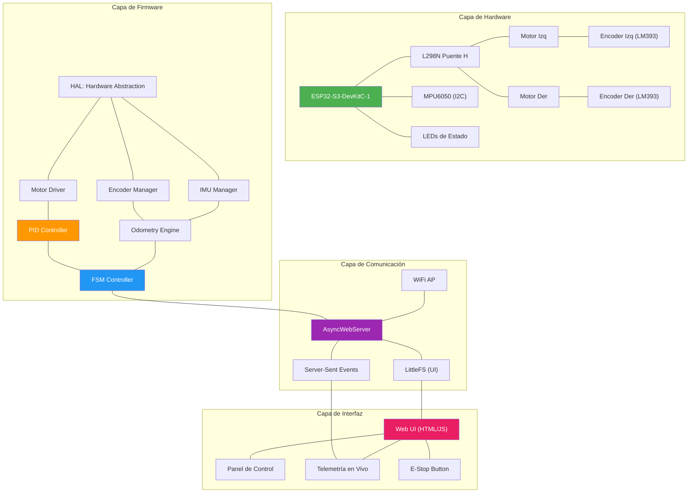
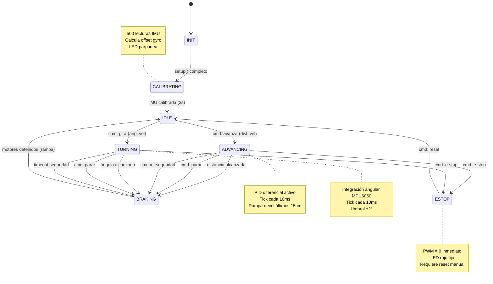
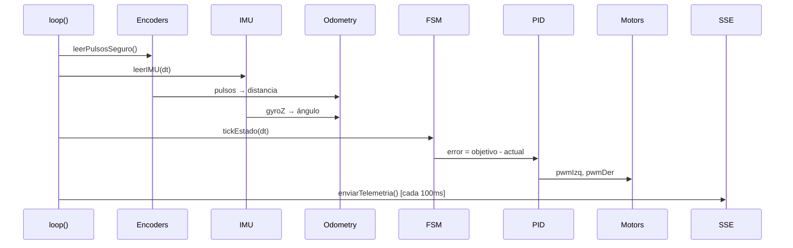

# 🏗️ Arquitectura del Sistema — Carro Robot Autónomo ESP32-S3

> [!NOTE]
> Este documento fusiona tres fuentes de información:
> - [new_template.txt](file:///d:/WindowsProyects/Antigravity/VeranoInve/resources_data/new_template.txt) — Código con MPU6050 + Encoders + Bluetooth + L298N
> - [hardware_pinout_specs.md](file:///d:/WindowsProyects/Antigravity/VeranoInve/hardware_pinout_specs.md) — Pin mapping y especificaciones del ESP32-S3
> - [Control_ESP32C3](file:///d:/WindowsProyects/Antigravity/VeranoInve/resources_data/Control_ESP32C3/) — Proyecto Wokwi original (esquemático de referencia)

---

## 1. Diagnóstico: Estado Actual vs. Objetivo

### 1.1 Análisis del `new_template.txt`

El código en `new_template.txt` es un **buen punto de partida** pero tiene problemas críticos que heredó de la arquitectura bloqueante:

| Aspecto | Estado Actual | Problema | Solución |
|---|---|---|---|
| **Arquitectura** | `while()` bloqueante en `avanzarDistancia()` | Imposible agregar WiFi/BLE sin watchdog reset | FSM no-bloqueante |
| **IMU** | `Adafruit_MPU6050` con lectura en loop | Sin calibración, integración cruda | Calibración + filtro complementario |
| **Encoders** | ISR sin `portMUX` | Race condition en dual-core ESP32 | `portENTER_CRITICAL_ISR()` |
| **Comunicación** | `BluetoothSerial` (Classic BT) | No soportado en ESP32-C3/S3-C3 | WiFi AP + AsyncWebServer |
| **PWM** | `ledcWrite(pin, value)` nueva API ✅ | Correcto para ESP32 Core v3.x | Mantener |
| **Constantes** | `Cm = 1.25` hardcoded | Sin documentación de cálculo | `CM_POR_PULSO = π × D / 20` |

### 1.2 Análisis del `Control_ESP32C3` (Wokwi)

El proyecto Wokwi original modela un **control manual** con:
- 3 potenciómetros → velocidad
- 8 DIP switches → dirección, enable, LEDs, E-Stop
- 6 LEDs con compuertas NOT → indicadores de estado
- Clase `MotorContinua` con OOP

**Lo que necesitamos adaptar del esquemático Wokwi:**
- ✅ Estructura de ESP32-S3 como placa base
- ✅ Conexiones al puente H (simulado con LEDs de dirección)
- ❌ Quitar potenciómetros y DIP switches (control manual)
- ➕ Agregar MPU6050 (I2C)
- ➕ Agregar encoders (GPIO con ISR)
- ➕ Mantener LEDs de estado para feedback visual

---

## 2. Arquitectura del Sistema

### 2.1 Diagrama de Módulos



### 2.2 Diagrama de Estados (FSM)



### 2.3 Flujo de Datos en un Tick (10ms)



---

## 3. Pin Mapping — ESP32-S3-DevKitC-1

### 3.1 Asignación Definitiva

Basado en [hardware_pinout_specs.md](file:///d:/WindowsProyects/Antigravity/VeranoInve/hardware_pinout_specs.md):

```cpp
// ═══════════════════════════════════════════════════════════
// PIN MAPPING — ESP32-S3-DevKitC-1 (Navegación Autónoma)
// ═══════════════════════════════════════════════════════════

// --- PUENTE H (L298N) ---
#define PIN_ENA  15    // PWM Motor Izquierdo (Enable A)
#define PIN_IN1  16    // Dirección Motor Izquierdo
#define PIN_IN2  17    // Dirección Motor Izquierdo
#define PIN_ENB  18    // PWM Motor Derecho (Enable B)
#define PIN_IN3   8    // Dirección Motor Derecho
#define PIN_IN4   9    // Dirección Motor Derecho (reubicado: GPIO3 es strapping)

// --- ENCODERS (LM393 Infrarrojo, disco 20 ranuras) ---
#define PIN_ENC_IZQ  4   // D0 encoder izquierdo (interrupción)
#define PIN_ENC_DER  5   // D0 encoder derecho (interrupción)

// --- IMU (MPU6050 vía I2C) ---
#define PIN_SDA  6     // I2C Data
#define PIN_SCL  7     // I2C Clock

// --- LEDs de Estado ---
#define PIN_LED_STATUS  48  // LED RGB integrado del DevKit
#define PIN_LED_IDLE    38  // LED verde — robot listo
#define PIN_LED_MOVING  39  // LED azul — en movimiento
#define PIN_LED_ERROR   40  // LED rojo — error/E-Stop

// --- CONSTANTES FÍSICAS ---
#define RANURAS_ENCODER       20
#define DIAMETRO_RUEDA_CM     6.5f    // MEDIR CON VERNIER
#define CM_POR_PULSO          (PI * DIAMETRO_RUEDA_CM / RANURAS_ENCODER)  // ≈ 1.021
#define DISTANCIA_ENTRE_RUEDAS_CM  15.0f  // MEDIR centro a centro
```

### 3.2 Pines Evitados y Justificación

| Pines Evitados | Razón |
|---|---|
| GPIO0 | Strapping: boot mode select |
| GPIO19, GPIO20 | USB D-/D+ |
| GPIO26–32 | Flash/PSRAM SPI interno |
| GPIO45, GPIO46 | Strapping: VDD_SPI / Boot mode |

### 3.3 Diagrama de Conexiones

```
ESP32-S3-DevKitC-1          L298N Puente H          Motores
┌──────────────┐           ┌──────────────┐      ┌──────────┐
│         GP15 ├──────────►│ ENA (PWM)    │      │          │
│         GP16 ├──────────►│ IN1          ├─────►│ Motor    │
│         GP17 ├──────────►│ IN2          ├─────►│ Izquierdo│
│              │           │              │      └──────────┘
│         GP18 ├──────────►│ ENB (PWM)    │      ┌──────────┐
│          GP8 ├──────────►│ IN3          ├─────►│ Motor    │
│          GP9 ├──────────►│ IN4          ├─────►│ Derecho  │
│              │           │              │      └──────────┘
│          GND ├──────────►│ GND          │ ← GND COMÚN
└──────────────┘           └──────────────┘

ESP32-S3                   Encoders LM393 (×2)
┌──────────────┐           ┌──────────────┐
│          GP4 ├───ISR────►│ D0 (izq)     │
│          GP5 ├───ISR────►│ D0 (der)     │
│         3V3  ├──────────►│ VCC (ambos)  │
│          GND ├──────────►│ GND (ambos)  │
└──────────────┘           └──────────────┘

ESP32-S3                   MPU6050 (I2C)
┌──────────────┐           ┌──────────────┐
│          GP6 ├───SDA────►│ SDA          │
│          GP7 ├───SCL────►│ SCL          │
│         3V3  ├──────────►│ VCC (3.3V)   │
│          GND ├──────────►│ GND          │
└──────────────┘           └──────────────┘

ESP32-S3                   LEDs de Estado
┌──────────────┐           ┌──────┐
│         GP38 ├──►[220Ω]──►│ 🟢  │ IDLE
│         GP39 ├──►[220Ω]──►│ 🔵  │ MOVING
│         GP40 ├──►[220Ω]──►│ 🔴  │ ERROR
└──────────────┘           └──────┘
```

---

## 4. Estructura del Código Fuente

```
VeranoInve/
├── platformio.ini           ← Configuración ESP32-S3 + librerías
├── src/
│   └── main.cpp             ← Entry point + loop principal
├── include/
│   ├── config.h             ← Pin mapping + constantes físicas
│   ├── fsm.h                ← Máquina de estados
│   ├── motor_driver.h       ← Control de motores L298N
│   ├── encoder_manager.h    ← Lectura segura de encoders
│   ├── imu_manager.h        ← MPU6050 + calibración + filtro
│   ├── pid_controller.h     ← PID diferencial
│   ├── odometry.h           ← Cálculo de posición (x, y, θ)
│   └── web_server.h         ← WiFi AP + AsyncWebServer + SSE
├── data/                    ← UI web (servida por LittleFS)
│   ├── index.html
│   ├── style.css
│   └── app.js
└── wokwi/
    ├── diagram.json          ← Esquemático Wokwi adaptado
    ├── wokwi.toml            ← Config de simulación
    └── libraries.txt         ← Dependencias Wokwi
```

---

## 5. Plan de Implementación Adaptado

### Fase 0 — Setup del Proyecto ✅ (Día 1)
> Configurar PlatformIO con ESP32-S3

- [ ] Actualizar `platformio.ini` con librerías necesarias
- [ ] Crear estructura de archivos (`include/`, `data/`, `wokwi/`)
- [ ] Crear `config.h` con pin mapping definitivo
- [ ] Generar `diagram.json` Wokwi adaptado (ver Sección 6)
- [ ] Verificar compilación limpia

### Fase 1 — Motor Driver + Encoders (Semana 1)
> Base: controlar motores con feedback de encoders, sin bloqueo

- [ ] Implementar `motor_driver.h`: `avanzar()`, `girar()`, `detener()`, `setPWM()`
- [ ] Implementar `encoder_manager.h` con ISR protegidas por `portMUX`
- [ ] Implementar `config.h` con constantes calibrables
- [ ] **Test en Wokwi**: motores giran, encoders cuentan pulsos
- [ ] **Test en HW**: verificar conteo de pulsos en 1 metro real

### Fase 2 — FSM No-Bloqueante (Semana 1–2)
> `loop()` itera < 5ms. Nunca bloquea.

- [ ] Implementar `fsm.h` con estados: `INIT, CALIBRATING, IDLE, ADVANCING, TURNING, BRAKING, ESTOP`
- [ ] `main.cpp`: loop solo hace `leerSensores() → tickFSM() → enviarTelemetria()`
- [ ] Cada tick de estado es un **fragmento**, no un bucle
- [ ] Timeouts de seguridad por estado
- [ ] Control por Serial como interfaz temporal: `A100,200` = avanzar 100cm a PWM 200
- [ ] **Test**: medir `loop()` con `micros()` — debe ser < 5ms

### Fase 3 — PID Diferencial (Semana 2)
> El robot avanza en línea recta

- [ ] Implementar `pid_controller.h` con Kp, Ki, Kd configurables
- [ ] Error = pulsosIzq - pulsosDer → corrección PWM
- [ ] Rampa de aceleración (arranque suave)
- [ ] Rampa de desaceleración (últimos 15cm)
- [ ] **Calibración**: Kp=1.0, Ki=0.1 → medir desviación en 1m
- [ ] **Test**: desviación < 2cm en avance de 1m

### Fase 4 — IMU y Giros (Semana 2–3)
> Girar ángulos específicos con precisión ±3°

- [ ] Implementar `imu_manager.h`:
  - Calibración automática (500 lecturas en reposo → offset)
  - Conversión a °/s: `(gz - offsetZ) / 131.0f`
  - Integración: `angulo += gyroDPS * dt`
  - Filtro complementario: `0.98 * gyro + 0.02 * accel`
- [ ] Implementar `tickGiro()` en FSM
- [ ] Muestreo ≥ 100Hz
- [ ] **Test**: comandar giro 90° → medir con transportador

### Fase 5 — WiFi + Web Server (Semana 3–4)
> Control desde el navegador

- [ ] WiFi AP mode: `CarroRobot` (192.168.4.1)
- [ ] AsyncWebServer con endpoints REST:
  - `GET /avanzar?dist=X&vel=V`
  - `GET /girar?ang=Y&vel=V`
  - `GET /parar`
  - `GET /estop`
  - `GET /estado`
- [ ] SSE para telemetría push (`/events`)
- [ ] Servir UI desde LittleFS
- [ ] **Test**: abrir navegador → enviar comando → ver respuesta

### Fase 6 — Interfaz Web (Semana 4–5)
> UI profesional controlable desde el celular

- [ ] Panel de estado con indicador de color animado
- [ ] Controles: sliders + inputs para distancia/ángulo/velocidad
- [ ] Barra de progreso del movimiento
- [ ] Botón E-Stop: rojo, grande, siempre visible
- [ ] Telemetría en vivo: pulsos, distancia, ángulo, PWM
- [ ] Log de eventos con timestamps
- [ ] Responsive: optimizado para móvil

### Fase 7 — Trayectorias (Semana 5+)
> Secuencias de movimiento compuestas

- [ ] Cola de comandos: "avanza 50, gira 90, avanza 30"
- [ ] Odometría 2D: posición (x, y, θ) acumulada
- [ ] Visualización de trayectoria en canvas 2D
- [ ] Guardar/cargar trayectorias predefinidas

---

## 6. Esquemático Wokwi Adaptado

> [!IMPORTANT]
> El diagrama Wokwi ha sido generado y guardado en `wokwi/diagram.json`. Simula:
> - ESP32-S3-DevKitC-1 como MCU principal
> - 6 LEDs para simular salidas del puente H (IN1-IN4, ENA, ENB)
> - 2 push buttons para simular pulsos de encoder
> - MPU6050 conectado por I2C (GP6/GP7)
> - 3 LEDs de estado (idle/moving/error)
> - Resistencias de protección (220Ω)

Ver archivo generado: [diagram.json](file:///d:/WindowsProyects/Antigravity/VeranoInve/wokwi/diagram.json)

---

## 7. Dependencias del Proyecto

### PlatformIO (`platformio.ini`)

```ini
[env:esp32-s3-devkitc-1]
platform = espressif32
board = esp32-s3-devkitc-1
framework = arduino
monitor_speed = 115200
lib_deps =
    adafruit/Adafruit MPU6050@^2.2.6
    adafruit/Adafruit Unified Sensor@^1.1.14
    me-no-dev/ESP Async WebServer@^1.2.3
    me-no-dev/AsyncTCP@^1.1.1
board_build.filesystem = littlefs
```

### Wokwi (`libraries.txt`)

```
Adafruit MPU6050
Adafruit Unified Sensor
Adafruit BusIO
```

---

## 8. Métricas de Éxito

| Métrica | Valor Objetivo | Método de Verificación |
|---|---|---|
| Tiempo de `loop()` | < 5ms | `micros()` antes/después |
| Desviación en avance 1m | < 2cm | Cinta métrica |
| Precisión de giro 90° | ±3° | Transportador |
| Latencia de UI | < 200ms | Timestamp SSE vs render |
| Tiempo de conexión WiFi | < 3s | Cronómetro desde boot |
| Estabilidad | Sin watchdog reset en 1h | Logging serial |

---

## 9. Estado Actual (Verano 2026)

### 9.1 Contradicciones — Resumen de Resolución

De las 12 contradicciones detectadas en el análisis con Principio de No-Contradicción:

| Categoría | Cantidad | IDs |
|-----------|----------|-----|
| **Resueltas completamente** | 8 | C-02, C-03, C-04, C-05, C-06, C-10, C-11, C-12 |
| **Decisiones arquitecturales** | 2 | C-01 (hal_pins.cpp como fuente de verdad), C-08 (monolítico hasta que duela) |
| **Pendientes de calibración** | 2 | C-07 (CM_POR_PULSO requiere test empírico de 1m), C-09 (WiFi único — BLE descartado pero documentado) |

### 9.2 Nuevos Módulos

| Módulo | Archivos | Función |
|--------|----------|---------|
| **comandos** | `include/comandos.h`, `src/comandos.cpp` | Preprocesador de comandos con **auto-segmentación**: divide movimientos largos en tramos de máximo 50cm, aplicando factor de velocidad 80%, pausa de 400ms entre segmentos y margen de error de 2cm. También interpreta comandos en modo laberinto (`Lx,y`) y rutinas JSON. |
| **UserControlGUI** | `include/UserControlGUI.h`, `src/UserControlGUI.cpp` | Generación del dashboard web HTML completo. Renderiza interfaz glassmorphism con Tailwind CSS CDN, D-pad de control, gauges de telemetría y Canvas 2D para trayectoria en tiempo real. |

### 9.3 Nuevas Capacidades del Sistema

| Capacidad | Detalle |
|-----------|---------|
| **JSON `/api` endpoint** | ArduinoJson integrado. Acepta comandos estructurados vía POST: `{"cmd":"avanzar","dist":100,"vel":200}`. Soporta rutinas como arrays de comandos y navegación por coordenadas absolutas. |
| **Canvas 2D de trayectoria** | Visualización en tiempo real de la odometría dead-reckoning (`posX`, `posY`, `orientacionGlobal`) sobre un canvas HTML5 en el dashboard. Actualización vía polling cada 500ms. |
| **Modo Laberinto X/Y** | Navegación por coordenadas absolutas. El comando `Lx,y` calcula distancia y ángulo necesarios, encola los movimientos (GIRO + AVANCE) y los ejecuta secuencialmente. |
| **Rutinas JSON** | Secuencias predefinidas de movimientos enviadas como array JSON. Ejemplo: `[{"cmd":"avanzar","dist":50},{"cmd":"girar","ang":90}]`. |
| **Segmentación de movimiento** | Todo comando de avance se divide automáticamente en segmentos configurables (máx 50cm, 80% velocidad, 400ms pausa, 2cm margen de error). Parámetros ajustables desde `comandos.h`. |
| **Dashboard premium** | Interfaz glassmorphism con Tailwind CSS CDN, D-pad interactivo, sliders de velocidad, botón E-STOP prominente, gauges animados, Canvas 2D, y log de eventos. Servido desde PROGMEM por WebServer síncrono. |

### 9.4 Skill de Verificación

Se creó el skill **supervisor-metadialectico** en `.opencode/skills/supervisor-metadialectico.md`, que define un procedimiento formal de 4 fases (Detección → Análisis Causal Aristotélico → Cálculo Leibniziano → Determinatio) para auditar cualquier proyecto con el Principio de No-Contradicción. Incluye comandos grep/powershell concretos y un checklist pre-commit.


<!-- Plan (Objetivo) Do (Implementacion) -->
