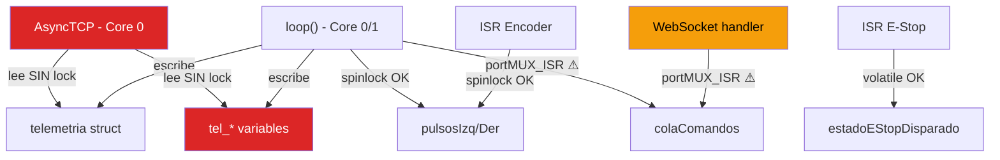

# 🔍 Auditoría de Código — Carro Robot Autónomo ESP32-S3

**Fecha:** 2026-06-27  
**Alcance:** Todo el firmware (`main.cpp`, `web_server.cpp`, `comandos.cpp`, `config_manager.cpp`, `hal_pins.cpp`, `UserControlGUI.cpp`, headers)

---

## Resumen Ejecutivo

| Severidad | Cantidad |
|-----------|----------|
| 🔴 CRÍTICO | 5 |
| 🟠 ALTO | 7 |
| 🟡 MEDIO | 5 |
| 🔵 BAJO | 4 |
| **Total** | **21** |

---

## 🔴 CRÍTICO — Pueden causar crash, corrupción de datos o comportamiento indefinido

### BUG-01: Buffer overflow en WebSocket handler (`data[len] = 0`)

**Archivo:** [web_server.cpp](file:///d:/WindowsProyects/Antigravity/VeranoInve/src/web_server.cpp#L458)  
**Línea:** 458

```cpp
data[len] = 0;  // ⚠️ Escribe FUERA del buffer
```

El buffer `data` tiene `len` bytes (índices 0 a `len-1`). Escribir en `data[len]` es un **out-of-bounds write**. En un ESP32, esto puede sobrescribir memoria adyacente en la pila del task de AsyncTCP, causando crash o corrupción silenciosa.

**Corrección:**
```diff
-data[len] = 0;
-const char* msg = (const char*)data;
+char msgBuf[256];
+size_t copyLen = (len < sizeof(msgBuf) - 1) ? len : sizeof(msgBuf) - 1;
+memcpy(msgBuf, data, copyLen);
+msgBuf[copyLen] = 0;
+const char* msg = msgBuf;
```

---

### BUG-02: Race condition en variables de telemetría (multi-core)

**Archivo:** [web_server.cpp](file:///d:/WindowsProyects/Antigravity/VeranoInve/src/web_server.cpp#L41-L54)  
**Líneas:** 41-54, 734-754

Las variables `tel_*` se **escriben** desde el core Arduino (loop → `web_server_send_telemetry`) y se **leen** desde el core AsyncTCP (callback de `/status` y `ws_push_telemetry`). **No hay ningún mecanismo de sincronización** (spinlock ni mutex) protegiendo este acceso.

Esto produce **tearing de datos**: el handler HTTP puede leer un estado inconsistente donde `tel_distancia` es del tick N pero `tel_estado` es del tick N+1.

**Corrección:** Proteger lectura/escritura con `portMUX_TYPE muxTelWeb`:
```cpp
// Escribir (desde loop):
portENTER_CRITICAL(&muxTelWeb);
tel_distancia = distancia;
// ... todas las demás
portEXIT_CRITICAL(&muxTelWeb);

// Leer (desde handler async):
portENTER_CRITICAL(&muxTelWeb);
float d = tel_distancia;
// ... copiar a locales
portEXIT_CRITICAL(&muxTelWeb);
```

---

### BUG-03: Doble envío de telemetría WebSocket (desperdicio de CPU y ancho de banda)

**Archivo:** [web_server.cpp](file:///d:/WindowsProyects/Antigravity/VeranoInve/src/web_server.cpp#L706-L716) y [web_server.cpp](file:///d:/WindowsProyects/Antigravity/VeranoInve/src/web_server.cpp#L756-L777)

La telemetría se envía por WebSocket **dos veces** por ciclo:

1. `web_server_send_telemetry()` (línea 756): serializa JSON y llama `ws.textAll()` **cada vez** que se invoca desde `enviarTelemetriaSerial()` (cada 100ms).
2. `web_server_loop()` → `ws_push_telemetry()` (línea 714): **también** serializa y envía `ws.textAll()` cada 100ms.

Resultado: **20 mensajes JSON/segundo** en vez de 10. En un ESP32-S3 con WiFi AP, esto puede saturar el buffer TX de WebSocket y causar desconexiones.

**Corrección:** Eliminar la serialización duplicada en `web_server_send_telemetry()` o en `ws_push_telemetry()`. Mantener una sola vía.

---

### BUG-04: `portENTER_CRITICAL_ISR` usado fuera de contexto ISR

**Archivo:** [main.cpp](file:///d:/WindowsProyects/Antigravity/VeranoInve/src/main.cpp#L538-L540) y [main.cpp](file:///d:/WindowsProyects/Antigravity/VeranoInve/src/main.cpp#L770-L778)

```cpp
// tickFrenado() — NO es una ISR, es código de loop()
portENTER_CRITICAL_ISR(&muxSegmentacion);  // ⚠️ Debería ser portENTER_CRITICAL
```

```cpp
// STATE_IDLE handler — NO es ISR
portENTER_CRITICAL_ISR(&muxSegmentacion);  // ⚠️ Debería ser portENTER_CRITICAL
```

Usar `_ISR` fuera de un contexto de interrupción puede causar problemas con la gestión de interrupciones del FreeRTOS scheduler. En ESP-IDF, `portENTER_CRITICAL_ISR` deshabilita interrupciones de manera diferente que `portENTER_CRITICAL`.

**Corrección:** Cambiar a `portENTER_CRITICAL` / `portEXIT_CRITICAL` en todo código que corre en contexto de tarea.

---

### BUG-05: Memory leak en `handle_body_accumulation` cuando body no se consume

**Archivo:** [web_server.cpp](file:///d:/WindowsProyects/Antigravity/VeranoInve/src/web_server.cpp#L178-L186)

```cpp
request->_tempObject = new String();  // Allocación en heap
```

Si un request con body llega a un handler que **no** consume `_tempObject` (por ejemplo, un error 404 o un handler inesperado), el `String*` **nunca se libera**. Con muchos requests malformados, esto genera un **leak creciente** en el heap del ESP32.

> [!WARNING]
> ESPAsyncWebServer no llama destructores automáticos para `_tempObject`. El programador es responsable de liberar la memoria.

**Corrección:** Registrar un `onRequestBody` handler global o usar `server.onRequestBody()` con cleanup. Alternativamente, verificar y limpiar en `server.onNotFound`.

---

## 🟠 ALTO — Errores lógicos que producen resultados incorrectos

### BUG-06: Orientación global calculada doblemente al completar un giro

**Archivo:** [main.cpp](file:///d:/WindowsProyects/Antigravity/VeranoInve/src/main.cpp#L516)

```cpp
// tickGiro completado:
orientacionGlobal += objetivo.angulo * (PI / 180.0f);  // Línea 516
```

Pero en `cambiarEstado(STATE_TURNING)` (línea 323):
```cpp
angZ = 0;  // Reset ángulo integrado
```

El problema: `angZ` se resetea al entrar en TURNING y se integra durante el giro. Luego en tickGiro, al completar, se suma `objetivo.angulo` **completo** a orientacionGlobal. Pero si el giro real (medido por IMU) fue diferente al objetivo (por inercia, patinaje, etc.), la orientación global **no refleja la realidad**. Debería usarse `angZ` final (el valor real medido) en vez del `objetivo.angulo` (valor ideal).

**Corrección:**
```diff
-orientacionGlobal += objetivo.angulo * (PI / 180.0f);
+orientacionGlobal += angZ * (PI / 180.0f);  // Usar medición real del IMU
```

---

### BUG-07: `web_server_is_connected()` siempre retorna `false` en modo AP

**Archivo:** [web_server.cpp](file:///d:/WindowsProyects/Antigravity/VeranoInve/src/web_server.cpp#L726-L728)

```cpp
bool web_server_is_connected() {
    return WiFi.status() == WL_CONNECTED;  // ⚠️ En modo AP, esto es siempre false
}
```

En modo `WIFI_AP`, `WiFi.status()` retorna `WL_IDLE_STATUS` o `WL_NO_SHIELD`, nunca `WL_CONNECTED`. `WL_CONNECTED` solo aplica en modo STA.

**Corrección:**
```diff
bool web_server_is_connected() {
-    return WiFi.status() == WL_CONNECTED;
+    return WiFi.softAPgetStationNum() > 0;  // Al menos un cliente conectado al AP
}
```

---

### BUG-08: `web_server_get_ip()` retorna `0.0.0.0` en modo AP

**Archivo:** [web_server.cpp](file:///d:/WindowsProyects/Antigravity/VeranoInve/src/web_server.cpp#L730-L732)

```cpp
String web_server_get_ip() {
    return WiFi.localIP().toString();  // ⚠️ localIP() es para modo STA
}
```

En modo AP, la IP correcta se obtiene con `WiFi.softAPIP()`.

**Corrección:**
```diff
-return WiFi.localIP().toString();
+return WiFi.softAPIP().toString();
```

---

### BUG-09: Truncamiento silencioso de `velSegmento` a `float` y luego cast a `int`

**Archivo:** [comandos.cpp](file:///d:/WindowsProyects/Antigravity/VeranoInve/src/comandos.cpp#L13)

```cpp
float velSegmento = (int)(velocidad * FACTOR_VELOCIDAD_SEGMENTO);
```

La variable se declara como `float` pero se inicializa con un cast a `int`, lo que **trunca** el resultado. Luego se compara con `50` como float. Aunque funciona, la intención es confusa y potencialmente incorrecto si se usan velocidades fraccionarias.

**Corrección:** Usar `int` consistentemente:
```diff
-float velSegmento = (int)(velocidad * FACTOR_VELOCIDAD_SEGMENTO);
+int velSegmento = (int)(velocidad * FACTOR_VELOCIDAD_SEGMENTO);
```

---

### BUG-10: Reset de E-Stop via WebSocket `RESET` no limpia el flag `estadoEStopDisparado`

**Archivo:** [web_server.cpp](file:///d:/WindowsProyects/Antigravity/VeranoInve/src/web_server.cpp#L464-L468)

```cpp
} else if (strcmp(msg, "RESET") == 0) {
    // Solo limpia la cola, NO limpia estadoEStopDisparado ni cambia estado FSM
    colaHead = 0; colaTail = 0; colaCount = 0;
}
```

Si el E-Stop se activó por ISR (`estadoEStopDisparado = true`), el RESET via WebSocket limpia la cola pero **no** limpia el flag, por lo que el siguiente tick de `loop()` volverá a entrar en `STATE_ESTOP` inmediatamente.

**Corrección:** El handler RESET debería encolar un comando de reset o comunicar el reset al loop principal de manera segura.

---

### BUG-11: `handle_raw` comando 'R' (Reset) no hace nada funcional

**Archivo:** [web_server.cpp](file:///d:/WindowsProyects/Antigravity/VeranoInve/src/web_server.cpp#L428-L431)

```cpp
if (tipo == 'R' || tipo == 'r') {
    request->send(200, "text/plain", "RESET");
    return;  // ⚠️ Solo responde OK, no cambia estado FSM ni limpia E-Stop
}
```

El endpoint `/raw?cmd=R` responde "RESET" pero no ejecuta ninguna lógica de reset. El robot seguirá en `STATE_ESTOP`.

---

### BUG-12: `WiFi.softAP()` usa `WIFI_SSID` / `WIFI_PASSWORD` hardcoded en vez de config_manager

**Archivo:** [web_server.cpp](file:///d:/WindowsProyects/Antigravity/VeranoInve/src/web_server.cpp#L594)

```cpp
bool apOk = WiFi.softAP(WIFI_SSID, WIFI_PASSWORD);
```

A pesar de que existe `config_manager_get_wifi_ssid()` y `config_manager_get_wifi_password()` específicamente para esto, `web_server_init()` usa los `#define` hardcodeados, ignorando completamente la configuración persistente.

**Corrección:**
```diff
-bool apOk = WiFi.softAP(WIFI_SSID, WIFI_PASSWORD);
+String ssid = config_manager_get_wifi_ssid();
+String pass = config_manager_get_wifi_password();
+bool apOk = WiFi.softAP(ssid.c_str(), pass.c_str());
```

---

## 🟡 MEDIO — Problemas que degradan rendimiento o robustez

### BUG-13: `IMU_GYRO_SENSITIVITY` definido pero nunca utilizado

**Archivo:** [config.h](file:///d:/WindowsProyects/Antigravity/VeranoInve/include/config.h#L60)

```cpp
#define IMU_GYRO_SENSITIVITY 131.0f  // Para rango ±250°/s
```

Pero el MPU6050 se configura con `MPU6050_RANGE_500_DEG` (línea 339 de main.cpp), que tiene sensibilidad de **65.5 LSB/(°/s)**, no 131. Además, la biblioteca Adafruit ya devuelve datos en rad/s, por lo que esta constante es **dead code** con un valor incorrecto.

> [!NOTE]
> No afecta al funcionamiento actual porque no se usa, pero puede confundir a futuros desarrolladores que intenten usarla.

---

### BUG-14: API `ledcSetup`/`ledcAttachPin`/`ledcWrite` deprecada en ESP-IDF 5.x

**Archivo:** [hal_pins.cpp](file:///d:/WindowsProyects/Antigravity/VeranoInve/src/hal_pins.cpp#L129-L132)

```cpp
ledcSetup(PWM_CHANNEL_ENA, PWM_FRECUENCIA, PWM_RESOLUCION);
ledcAttachPin(PIN_ENA, PWM_CHANNEL_ENA);
```

Con Arduino-ESP32 v3.x (basado en ESP-IDF 5.x), la API antigua de LEDC ha sido deprecada. La nueva API es:

```cpp
ledcAttach(PIN_ENA, PWM_FRECUENCIA, PWM_RESOLUCION);
ledcWrite(PIN_ENA, 0);  // Ahora usa pin, no canal
```

> [!IMPORTANT]
> Dependiendo de la versión de `platform = espressif32` en platformio.ini, esto puede compilar con warnings o fallar directamente.

---

### BUG-15: `String tel_estado` en web_server sin protección de concurrencia

**Archivo:** [web_server.cpp](file:///d:/WindowsProyects/Antigravity/VeranoInve/src/web_server.cpp#L47)

```cpp
String tel_estado = "INIT";
```

La clase `String` de Arduino **no es thread-safe**. `tel_estado` se escribe desde `web_server_send_telemetry()` (core Arduino) y se lee desde los handlers HTTP (core AsyncTCP). Una asignación concurrent puede corromper el buffer interno del String, causando crash o lecturas basura.

**Corrección:** Usar `char tel_estado[16]` con `strncpy()` protegido por spinlock, o copiar bajo sección crítica.

---

### BUG-16: Sin debounce en E-Stop (ISR + polling)

**Archivo:** [main.cpp](file:///d:/WindowsProyects/Antigravity/VeranoInve/src/main.cpp#L155-L159) y [main.cpp](file:///d:/WindowsProyects/Antigravity/VeranoInve/src/main.cpp#L742)

El botón E-Stop dispara ISR en `RISING` sin debounce. Un bounce mecánico puede generar múltiples transiciones y múltiples prints de `Serial.println("[E-STOP] Emergencia detectada por ISR!")`, sobrecargando el buffer serial. Adicionalmente, el polling redundante en loop (línea 742) puede detectar un bounce como evento separado.

**Corrección:** Agregar debounce en ISR:
```cpp
void IRAM_ATTR isrEStop() {
    static unsigned long lastTrigger = 0;
    unsigned long now = millis();  // millis() es IRAM-safe en ESP32
    if (now - lastTrigger > 200) {
        estadoEStopDisparado = true;
        lastTrigger = now;
    }
}
```

---

### BUG-17: Número de paso duplicado en comentarios del loop

**Archivo:** [main.cpp](file:///d:/WindowsProyects/Antigravity/VeranoInve/src/main.cpp#L818-L821)

```cpp
// ⑦ Handle web clients (polling de DNS local)
web_server_loop();

// ⑦ Medir duración del loop   ← DUPLICADO, debería ser ⑧
```

---

## 🔵 BAJO — Mejoras de estilo, mantenibilidad y robustez menor

### BUG-18: XSS potencial en `limpiarRuta()` via `innerHTML`

**Archivo:** [UserControlGUI.cpp](file:///d:/WindowsProyects/Antigravity/VeranoInve/src/UserControlGUI.cpp#L680) y [UserControlGUI.cpp](file:///d:/WindowsProyects/Antigravity/VeranoInve/src/UserControlGUI.cpp#L695)

```javascript
list.innerHTML = '';  // Línea 695
document.getElementById('waypoints-list').innerHTML = '<div ...>';  // Línea 680
```

En un contexto de Access Point local sin internet, el riesgo XSS es mínimo, pero rompe la consistencia: en `limpiarLog()` (línea 253) se usó `replaceChildren()` correctamente con el comentario `// AP-001 XSS innerHTML fix`, pero `limpiarRuta()` sigue usando `innerHTML`.

---

### BUG-19: `handle_status` reporta `WiFi.status() == WL_CONNECTED` en modo AP

**Archivo:** [web_server.cpp](file:///d:/WindowsProyects/Antigravity/VeranoInve/src/web_server.cpp#L99)

```cpp
doc["connected"] = (WiFi.status() == WL_CONNECTED);  // Siempre false en AP
```

Esto hará que la UI siempre muestre "desconectado" en el campo `connected` del JSON de status, confundiendo al usuario.

---

### BUG-20: Buffer fijo de 512 bytes para parsing de ruta WebSocket

**Archivo:** [web_server.cpp](file:///d:/WindowsProyects/Antigravity/VeranoInve/src/web_server.cpp#L489-L491)

```cpp
char buf[512];
strncpy(buf, msg + 5, sizeof(buf));
```

Si el mensaje `RUTA:...` tiene más de 512 caracteres (muchos waypoints), se trunca silenciosamente. Con coordenadas como `X123.4Y567.8;`, cada waypoint ocupa ~17 chars, permitiendo ~30 waypoints máximo. Pero `COLA_MAX_COMANDOS` es solo 10, así que en la práctica no debería ser problema. Sin embargo, el truncamiento es silencioso (no se reporta al usuario).

---

### BUG-21: `config_manager_init()` nunca cierra NVS (`prefs.end()` ausente)

**Archivo:** [config_manager.cpp](file:///d:/WindowsProyects/Antigravity/VeranoInve/src/config_manager.cpp#L19)

```cpp
prefs.begin(NVS_NAMESPACE, false);  // Abierto para siempre
```

Aunque en un sistema embebido que nunca hace shutdown limpio esto es benigno, `Preferences` mantiene un handle NVS abierto permanentemente. Si en el futuro se agrega OTA o deep sleep, esto podría causar problemas de flush de datos pendientes.

---

## Diagrama de dependencias y puntos de riesgo



---

## Priorización recomendada

| Orden | Bug | Impacto | Esfuerzo |
|-------|-----|---------|----------|
| 1 | BUG-01 | Crash potencial | 5 min |
| 2 | BUG-02 | Data corruption | 15 min |
| 3 | BUG-03 | Performance | 5 min |
| 4 | BUG-04 | ISR context | 5 min |
| 5 | BUG-12 | Config ignorada | 5 min |
| 6 | BUG-06 | Odometría incorrecta | 2 min |
| 7 | BUG-07/08 | API inutil en AP | 2 min |
| 8 | BUG-15 | String thread-safety | 10 min |
| 9 | BUG-10/11 | E-Stop reset roto | 15 min |
| 10 | BUG-16 | Bounce noise | 5 min |

> [!TIP]
> Los bugs 01-04 son los más urgentes. Se pueden corregir todos en ~30 minutos. ¿Deseas que proceda con las correcciones?
